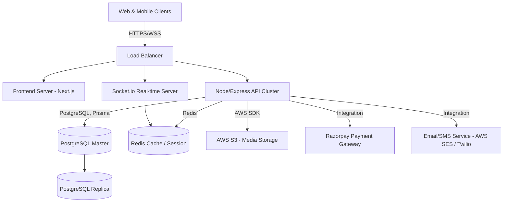

# Full Product Architecture: InteriorConnect Tamil Nadu

## 1. High-Level System Architecture
The platform is designed as a modern decoupled full-stack application, ensuring scalability, maintainability, and high performance.

### 1.1 Tech Stack
- **Frontend**: Next.js (App Router), React, Vanilla CSS modules (for premium aesthetics).
- **Backend API**: Node.js + Express.js
- **Database**: PostgreSQL (relational is best suited for marketplaces, transactions, bookings, and complex querying). Prisma ORM for type-safe database access.
- **Real-time Engine**: Socket.io (for chat and live notifications).
- **Cloud Storage**: AWS S3 (for portfolio images, 3D assets, videos) + CloudFront (CDN).
- **Authentication**: JWT (JSON Web Tokens) with NextAuth or Passport.js, enabling secure email+password as well as Google/Facebook/Apple OAuth.
- **Payment Gateway**: Razorpay (standard for India market, handles UPI, cards, NetBanking easily).

## 2. Infrastructure Diagram (Conceptual)


## 3. Project Structure
We will structure the project conceptually as a separated frontend/backend application.

```
interior-project/
├── frontend/ (Next.js Application)
│   ├── public/         # Static assets
│   ├── src/
│   │   ├── app/        # Next.js App Router pages
│   │   ├── components/ # Reusable UI components
│   │   ├── store/      # State management (Zustand/Context)
│   │   └── styles/     # Premium Vanilla CSS styles
├── backend/ (Node.js API)
│   ├── src/
│   │   ├── controllers/# Request handlers
│   │   ├── models/     # DB models
│   │   ├── routes/     # API route definitions
│   │   ├── sockets/    # Socket.io handlers
│   │   └── index.ts    # Entry point
```

## 4. Scalability Plan
- **Caching**: Implement Redis to cache frequent queries (e.g., designer lists, location filtering).
- **Database Indexing**: Create B-tree and text search indexes on Designer profiles (location, styles) for lightning-fast search discovery.
- **Asset Delivery**: Serve all portfolios via CDN with automatic image optimization/resizing.
- **Microservices Path**: As the platform grows, the Chat, Billing, and Core API can be split into autonomous microservices.
