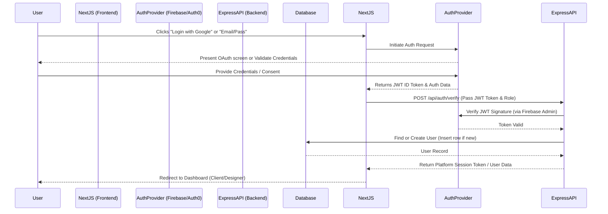
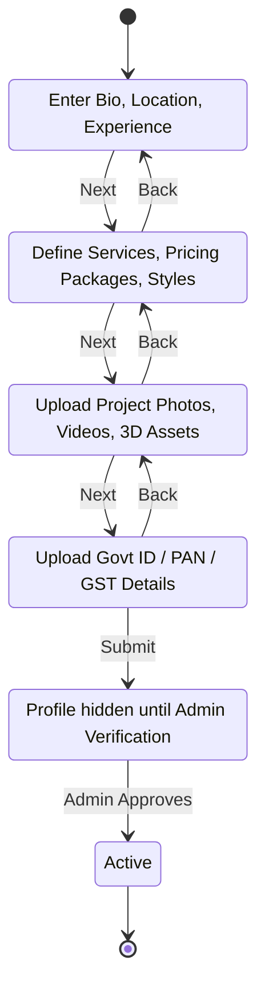

# Authentication & Onboarding Flow Diagrams

## 1. Multi-Provider Login / Signup Flow

```mermaid
sequenceDiagram
    participant User
    participant NextJS (Frontend)
    participant AuthProvider (Firebase/Auth0)
    participant ExpressAPI (Backend)
    participant Database

    User->>NextJS: Clicks "Login with Google" or "Email/Pass"
    NextJS->>AuthProvider: Initiate Auth Request
    AuthProvider-->>User: Present OAuth screen or Validate Credentials
    User->>AuthProvider: Provide Credentials / Consent
    AuthProvider-->>NextJS: Returns JWT ID Token & Auth Data
    
    NextJS->>ExpressAPI: POST /api/auth/verify (Pass JWT Token & Role)
    ExpressAPI->>AuthProvider: Verify JWT Signature (via Firebase Admin)
    AuthProvider-->>ExpressAPI: Token Valid
    
    ExpressAPI->>Database: Find or Create User (Insert row if new)
    Database-->>ExpressAPI: User Record
    
    ExpressAPI-->>NextJS: Return Platform Session Token / User Data
    NextJS-->>User: Redirect to Dashboard (Client/Designer)
```

## 2. Designer Multi-Step Onboarding Flow

```mermaid
stateDiagram-v2
    [*] --> Step1_BasicInfo
    
    Step1_BasicInfo: Enter Bio, Location, Experience
    Step1_BasicInfo --> Step2_Services: Next
    
    Step2_Services: Define Services, Pricing Packages, Styles
    Step2_Services --> Step1_BasicInfo: Back
    Step2_Services --> Step3_Portfolio: Next
    
    Step3_Portfolio: Upload Project Photos, Videos, 3D Assets
    Step3_Portfolio --> Step2_Services: Back
    Step3_Portfolio --> Step4_Verification: Next
    
    Step4_Verification: Upload Govt ID / PAN / GST Details
    Step4_Verification --> Step3_Portfolio: Back
    Step4_Verification --> PendingApproval: Submit

    PendingApproval: Profile hidden until Admin Verification
    PendingApproval --> Active: Admin Approves
    Active --> [*]
```
